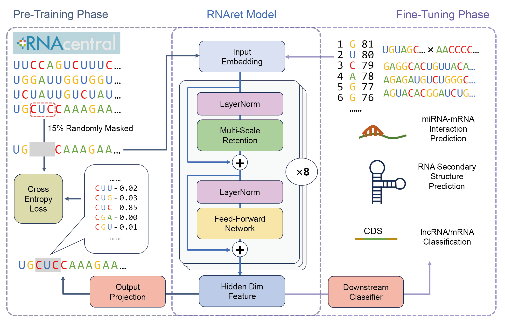

# RNAret: RNA Language Model based on Retentive Network

## Introduction

RNAret is a user-friendly tool designed for the prediction of RNA-RNA interactions. It empip install pipreqsploys advanced algorithms to analyze and identify potential interactions between different RNA molecules, which can be crucial for understanding various biological processes. This tool is particularly useful for researchers in molecular biology and bioinformatics who are interested in studying RNA interactions.



## Installation

To start using RNAret, please clone the RNAret repository and prepare the conda environment using the following command:
   ```
   git clone https://github.com/DrBlackZJU/RNAret.git
   cd RNAret
   conda create -n RNAret python=3.10
   conda activate RNAret
   pip install -r requirements.txt
   ```

## Data Preparation

To download model weights and down-stream datasets, please visit https://bis.zju.edu.cn/rnaret/download/. Please download the `model.tar.gz` and `datasets.tar.gz` files, place them in the root directory and extract them.

We use RNAcentral database as our pretraining dataset: https://ftp.ebi.ac.uk/pub/databases/RNAcentral/releases/21.0/sequences/rnacentral_active.fasta.gz. You can also use FASTA format for your own data. If you feel struggling to load FASTA format in the `pretrain.py` script, you can use the `pretrain_preprocess.py` script to convert FASTA format to txt format:
   ```shell
   python pretrain_preprocess.py --input_file rnacentral_active.fasta.gz --output_file rnacentral_active.txt -k 5 --max_len 2000
   ```

## Pretraining

We use a ​BERT-like MLM (Masked Language Modeling) task to pretrain ​RNAret. To pretrain the model, you can run the following command:
  ```shell
  python pretrain.py -n pretrain -k 3 -i data/rnacentral_active.fasta --max_len 2000 -o model/pretrain --cycle_steps 50000
  ```
Both ​FASTA files and files that have been preprocessed by `​pretrain_preprocess.py` are acceptable.

## Fine-tuning

To reproduce the fine-tuning experiments, you can run our scripts as follows:

### Example 1: miRNA-mRNA Interaction Prediction
```shell
python rri.py -n MirTar -k 5 -i data/data_DeepMirTar_miRAW_noRepeats_3folds_train.txt -e data/data_DeepMirTar_miRAW_noRepeats_3folds_test.txt --pretrain_model_path model/pretrain/pretrain_5mer.pth
```
Using command-line arguments, you can choose different values of k, datasets, or paths to pre-trained model weights as needed.

### Example 2: RNA Secondary Structure Prediction
```shell
python ssp.py -n RNAStrAlign -k 1 -i data/RNAStrAlign -e data/archiveII --pretrain_model_path model/pretrain/pretrain_1mer.pth
```
```shell
python ssp.py -n bpRNA -k 1 -i data/bpRNA/TR0 -v data/bpRNA/VL0 -e data/bpRNA/TS0 --pretrain_model_path model/pretrain/pretrain_1mer.pth
```
This script will read all `.bpseq` files in the folder with lengths less than or equal to the maximum length.

### Example 3: mRNA/lncRNA Classification
```shell
python lnc.py -n lnc_H -k 5 -i data/lncRNA_H/train.fa -e data/lncRNA_M/test.fa --pretrain_model_path model/pretrain/pretrain_5mer.pth
```
The FASTA file used for this task needs to have the ​CDS (Coding Sequence) regions annotated in the ​description line.

## Evaluation

To test the fine-tuned model and obtain the performance metrics on the test set., you can run our scripts as follows:

### Example 1: miRNA-mRNA Interaction Prediction
```shell
python rri.py -n Ind -k 5 -e data/data_DeepMirTar_IndTest_noRepeats_3folds.txt --rri_model_path model/rri/MirTar_5mer.pth --eval_only
```

### Example 2: RNA Secondary Structure Prediction
```shell
python ssp.py -n archiveII -k 1 -e data/archiveII --ssp_model_path model/ssp/RNAStrAlign_1mer.pth --eval_only
```
Also, you can use `​ssp2dot.py` to predict the secondary structure of each sequence from a FASTA file and output a dot-bracket file.
```shell
python ssp2dot.py -i whatever.fasta -o output.dot -k 1 --ssp_model_path model/ssp/RNAStrAlign_1mer.pth
```

### Example 3: mRNA/lncRNA Classification
```shell
python lnc.py -n lnc_M -k 5 -e data/lncRNA_M/test.fa --lnc_model_path model/lnc/lnc_M_5mer.pth --eval_only
```

Other command-line arguments can modify pretrained model parameters, downstream classifier parameters, training hyperparameters, etc. Please refer to the source code or use `-h` or `--help` to view the options (e.g., ```python ssp.py -h```).

## Future Work

Our future directions include:

1. Expanding the capabilities of ​RNAret in more downstream biological tasks,
2. Developing generative nucleotide and protein language models based on ​RetNet,
3. Upgrading the ​RNAret web server service (https://bis.zju.edu.cn/rnaret).